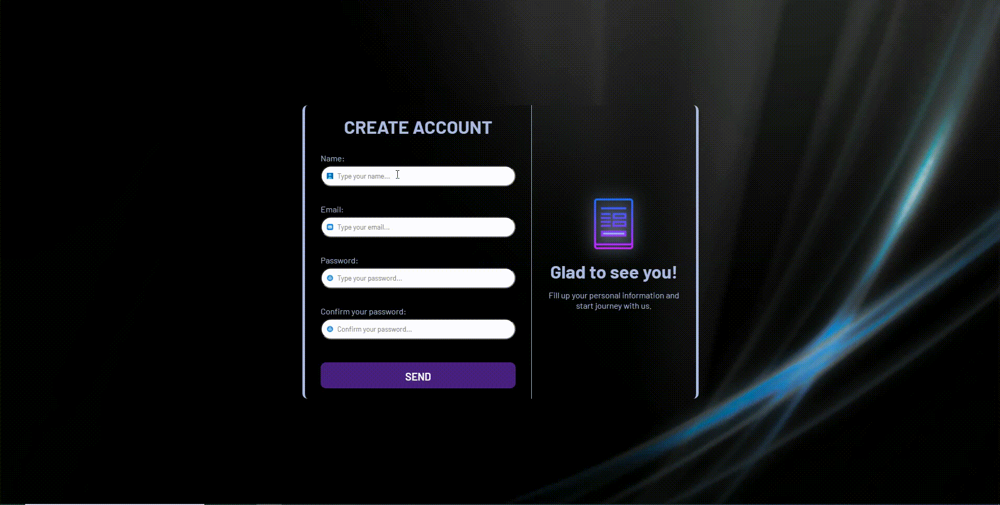

# Projeto - Form
Um projeto desenvolvido com o intuito de demonstrar a criação e um formulário com sua respectiva validação, através da inserção de nome, email, senha e confirmação de senha. Mostrará sinais de aprovação ou reprovação caso algum dado seja colocado indevidamente. 🚀❤🙌

[]

## Tecnologias utilizadas 🚀
- HTML5
- CSS3
- JAVASCRIPT
- PHOTOSHOP

## Por que desenvolvi o projeto?
Este trabalho foi desenvolvido com o intuito de demonstrar minhas habilidades com a programação por meio da criação de um formulário e sua respectiva validação quando o usuário logar. Os inputs contidos no projeto são o de nome, email, senha e confirmação de senha. Nesses dois últimos campos, as senhas deverão ter no mínimo de 8 caracteres e serem as mesmas. O formulário apresentará a cor verde nos inputs caso as informações inseridas estejam corretas e de acordo com a validação. Caso algum dado esteja errado, os inputs ficarão com a cor vermelha e apresentarão uma mensagem abaixo no input que estiver errado. Elaborei sua arte e design utilizando o photoshop. Espero que curtem e ajude compartilhando!!!

Feito com ❤ por Flávio Dias Moreira 👏 [Veja meu LinkedIn](https://www.linkedin.com/in/fl%C3%A1vio-dias-moreira-89102a218/)